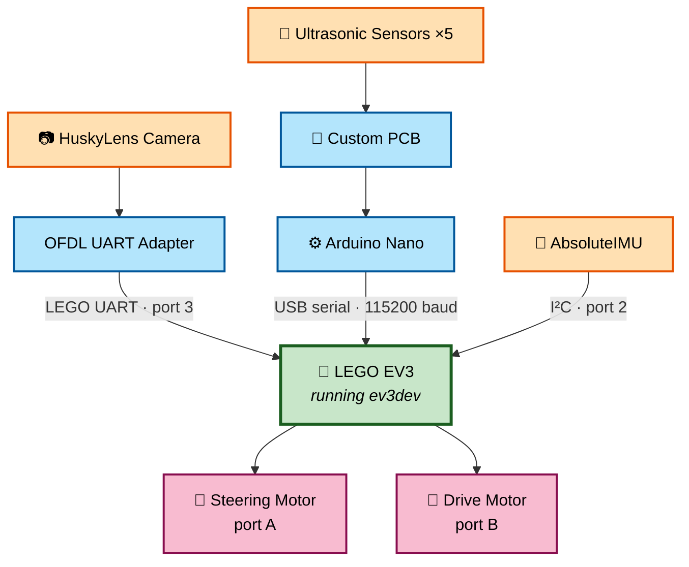
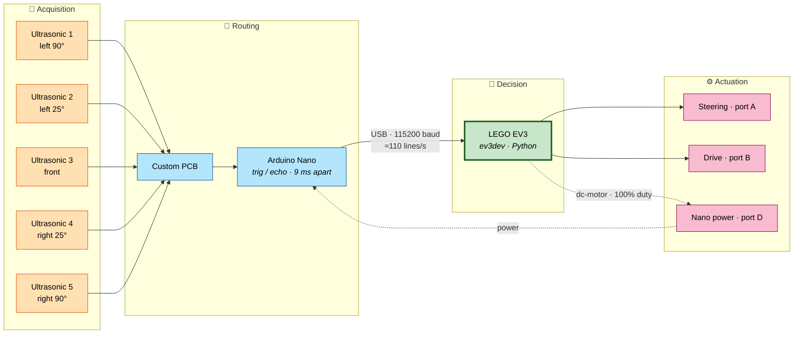
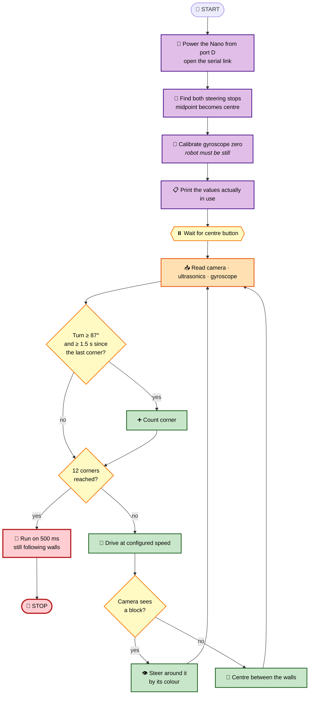

<div align="center">

# 🏎️ LOS GRISES JR
## World Robot Olympiad 2026  
### Future Engineers Category
<p align="center">
  
</p>

<br>


<br>


<br>


<br>

---

# 📷 Final Competition Robot

**Insert final robot hero image here**

*(Recommended image: front three-quarter view showing the complete vehicle)*

---

### Official Engineering Repository

Documentation of Team Los Grises Jr's autonomous vehicle developed for:
**World Robot Olympiad 2026 — Future Engineers Category**


---

</div>


# 🚗 Project Overview

Our robot is a fully autonomous four-wheel vehicle designed for the **World Robot Olympiad 2026 Future Engineers competition**.

The objective of this project is to develop a reliable autonomous vehicle capable of navigating the competition environment through a combination of:

- Mechanical engineering.
- Embedded electronics.
- Autonomous control algorithms.
- Sensor processing.
- Software architecture.
- Iterative testing and optimization.


The final platform combines:

| System | Implementation |
|:---|:---|
| Steering | Ackermann steering geometry |
| Drive System | Rear-wheel drive |
| Main Controller | LEGO Mindstorms EV3 Brick, running ev3dev (Debian Linux) |
| Coprocessor | 1 Arduino Nano, multiplexing the five ultrasonic sensors |
| Vision System | HuskyLens AI Camera, through a LEGO UART adapter |
| Distance Measurement | Five ultrasonic sensors |
| Communication | USB serial at 115200 baud, plus LEGO UART for the camera |
| Electronics | Custom-designed PCB |
| Control Algorithm | Proportional wall-centring, with measured filtering and hold-over |
| Control Software | Python, modular package (`Src/ev3dev`) |


---

# ⚡ Quick System Overview

<div align="center">



</div>


The robot uses a distributed architecture where each subsystem performs a specific role:

- The **Arduino Nano** measures the five ultrasonic sensors and streams them over USB.
- The **OFDL adapter** translates the HuskyLens output into the LEGO UART protocol, so the EV3 sees the camera as an ordinary sensor.
- The **EV3 Brick**, running ev3dev, performs navigation decisions and motion control in Python.
- The **Custom PCB** organizes power distribution and signal routing for the sensor array.

**Why USB instead of I²C.** The sensors originally reached the brick over
I²C on a sensor port. The EV3 does not have I²C hardware: it bit-bangs
the protocol in software and it runs at a few kHz. Moving the Nano to USB
at 115200 baud removed that bottleneck and freed a sensor port.


---

# 📑 Table of Contents

- [👥 Team](#-team)
- [🚗 Project Overview](#-project-overview)
- [⚡ Quick System Overview](#-quick-system-overview)
- [⭐ Engineering Highlights](#-engineering-highlights)
- [📊 Robot Specifications](#-robot-specifications)
- [📸 Vehicle Gallery](#-vehicle-gallery)
- [🔩 Components and Hardware](#-components-and-hardware)
- [🛠 Mechanical Design](#-mechanical-design)
- [⚡ Electronics](#-electronics)
- [🔌 Custom PCB](#-custom-pcb)
- [💻 Software Architecture](#-software-architecture)
- [📡 Ultrasonic Sensor Fusion](#-ultrasonic-sensor-fusion)
- [🎮 Wall-Centring Controller](#-wall-centring-controller)
- [👁 Camera Avoidance](#-camera-avoidance)
- [🎯 Automatic Steering Calibration](#-automatic-steering-calibration)
- [🧮 Corner Counting](#-corner-counting)
- [🧠 Engineering Decisions](#-engineering-decisions)
- [📈 Current Performance](#-current-performance)
- [📓 Engineering Journal](#-engineering-journal)
- [📂 Repository Structure](#-repository-structure)
- [🏁 Conclusion](#-conclusion)

---

<div align="center">

### 📚 Jump straight to the detail

[](docs/Engineering%20Journal.md)
[](docs/Logs_Tuning.md)
[](docs/Control_Model.md)
[](Src/ev3dev/README.md)

</div>


---

# 👥 Team


## 📷 Team Photo

<p align="center">

</p>


---

# 👨‍💻 Renato Medina
<p align="center">

</p>

## Team Captain

| Information | Details |
|:---|:---|
| Age | 14 |
| Role | Team Captain and Programmer |
| Main Areas | Software, Integration |


### Responsibilities

- 💻 Software Development
- 🤖 Autonomous Navigation Algorithms
- ⚙️ Mechanical Design
- 🔧 Robot Integration
- 🧠 System Architecture
- 📚 Technical Documentation


---

### About Renato

Renato serves as the **Team Captain** and leads the software architecture, autonomous navigation development, project documentation, and system integration of the robot.

His robotics journey began through the **OnStage TMR program**, where he developed a strong interest in autonomous systems, embedded programming, and engineering design.

Since then, he has focused on combining:

- Software development.
- Electronics.
- Mechanical design.
- Control systems.

to create reliable robotic platforms.

For the WRO 2026 season, his objective is to develop a highly reliable autonomous vehicle while expanding his knowledge of embedded systems, control theory, and robotic engineering.

---

# 👩‍🔧 Paulina

## Mechanical & Electronics Designer


| Information | Details |
|:---|:---|
| Role | Mechanical & Electronics Designer |
| Main Areas | Assembly, Electronics, Testing |


### Responsibilities

- 🔩 Mechanical Assembly
- ⚡ Electronics Integration
- 🔌 PCB Installation
- 🧪 Robot Testing
- 📐 Structural Optimization
- 🛠 Cable Organization


---

### About Paulina

Paulina is responsible for the robot's mechanical construction and electronic integration.

Her work focuses on:

- Structural assembly.
- Sensor installation.
- PCB integration.
- Mechanical validation.
- Hardware reliability.


Her contributions have been fundamental in transforming the initial prototype into a competition-ready autonomous vehicle with improved stability and maintainability.


📷 **Insert Paulina working on assembly image here**


---

# 🤝 Team Responsibilities


| Area | Renato | Paulina |
|:---|:---:|:---:|
| Mechanical Design | ✅ | ✅ |
| Robot Assembly | ✅ | ✅ |
| Electronics Integration | | ✅ |
| PCB Installation | ✅ | ✅ |
| Software Development | ✅ | |
| EV3 Programming | ✅ | |
| Arduino Programming | ✅ | |
| Documentation | ✅ | ✅ |
| Testing & Validation | ✅ | ✅ |


---

# ⭐ Engineering Philosophy


> [!IMPORTANT]
>
> The development of Los Grises Jr is based on continuous engineering improvement.
>
> Every subsystem has been tested, analyzed, modified, and optimized with three main objectives:
>
> - Increase reliability.
> - Improve repeatability.
> - Simplify maintenance.


---

# ⭐ Engineering Highlights


The current robot incorporates multiple engineering improvements developed specifically for the **WRO Future Engineers Challenge**.


| Feature | Implementation |
|:---|:---|
| Steering System | Ackermann steering geometry |
| Drive System | Rear-wheel drive |
| Sensors | Five ultrasonic sensors, with dropout filtering |
| Vision | HuskyLens AI camera, with hold-over and nearest-block selection |
| Coprocessor | 1 Arduino Nano streaming over USB |
| Electronics | Custom PCB |
| Communication | USB serial at 115200 baud |
| Steering Calibration | Automatic, measured against the mechanical stops |
| Control | Proportional, with every gain measured and recorded |
| Drive Control | Closed loop on the encoder, not raw power |
| Software | Modular Python package |
| Sensor Mounting | Custom 3D printed supports |
| Mechanical Design | Optimized weight distribution |


---

<div align="center">

# 📊 Robot Specifications


<div align="center">

| Specification | Value |
|:---|:---|
| Competition | WRO Future Engineers 2026 |
| Robot Type | Autonomous Vehicle |
| Dimensions | 24 × 23 × 18 cm |
| **Mass** | **861 g** |
| Maximum Allowed Size | 30 × 30 × 30 cm |
| Steering System | Ackermann Steering |
| Drive System | Rear-Wheel Drive |
| Chassis | LEGO Mindstorms EV3 |
| Main Controller | LEGO EV3 Brick running ev3dev |
| Coprocessor | Arduino Nano |
| Vision System | HuskyLens AI Camera |
| Distance Sensors | Five Ultrasonic Sensors |
| Gyroscope | mindsensors AbsoluteIMU |
| Communication Protocol | USB serial, 115200 baud |
| Custom Electronics | Custom PCB |
| Sensor Supports | 3D Printed |
| Programming Languages | Python (EV3) and Arduino C++ (Nano) |
| Control Loop Rate | ~30 Hz measured on track |

</div>


---

# 📸 Vehicle Gallery


The following images show the final competition vehicle from different perspectives.

These photographs demonstrate:

- Mechanical construction.
- Sensor placement.
- Electronics integration.
- Cable organization.
- Overall vehicle design.


<div align="center">


| Front View | Top View | Right Side |
|:---:|:---:|:---:|
|  |  |  |


| Left Side | Rear View | Bottom View |
|:---:|:---:|:---:|
|  |  |  |


</div>


> [!NOTE]
>
> A demostration video will be added after the final validation tests are completed.


---

# 🔩 Components and Hardware


The robot combines LEGO components with custom embedded electronics to create a modular and reliable autonomous platform.

Each component was selected according to:

- Reliability.
- Compatibility.
- Mechanical integration.
- Software requirements.
- Long-term maintainability.


| Component | Quantity | Function | Status |
|:---|:---:|:---|:---:|
| LEGO EV3 Brick | 1 | Main controller, runs ev3dev | ✅ |
| EV3 Medium Motor | 1 | Rear-wheel traction — **port B** | ✅ |
| EV3 Medium Motor | 1 | Ackermann steering — **port A** | ✅ |
| Ultrasonic Sensors | 5 | Distance measurement | ✅ |
| Arduino Nano | 1 | Sensor acquisition, USB serial | ✅ |
| HuskyLens AI Camera | 1 | Vision processing — **port 3** | ✅ |
| mindsensors AbsoluteIMU | 1 | Heading and corner counting — **port 2** | ✅ |
| OFDL UART Adapter | 1 | Presents the camera as a LEGO sensor | ✅ |
| Custom PCB | 1 | Power and signal distribution | ✅ |
| LEGO Wheels | 4 | Vehicle mobility | ✅ |
| 3D Printed Supports | Multiple | Sensor mounting | ✅ |

> [!NOTE]
> The complete port assignment, verified on the robot, is in
> [`mechanic/List of ports and components.md`](mechanic/List%20of%20ports%20and%20components.md).


---

# 🛠 Mechanical Design


## Design Evolution


The mechanical structure of the robot was developed through multiple iterations focused on:

- Structural rigidity.
- Weight distribution.
- Driving stability.
- Maintenance accessibility.
- Competition compliance.


Rather than modifying only a single prototype, the robot evolved progressively through testing and engineering improvements.

Every redesign addressed specific limitations discovered during previous experiments.

The result is a compact autonomous vehicle designed for reliability and repeatability.


---

## 📷 Mechanical Design Overview


<div align="center">

**Insert chassis evolution image here**

</div>


---

# 📏 Final Dimensions


| Measurement | Value |
|:---|:---:|
| Length | 24 cm |
| Width | 23 cm |
| Height | 18 cm |
| **Mass** | **861 g** |


The final design remains within the official WRO Future Engineers national competition limit of:

```
30 × 30 × 30 cm
```

### Why the mass is worth recording

861 g is not just a specification line. Combined with the drive motor's
running torque it sets the vehicle's dynamic limits:

| Derived quantity | Value |
|:---|---:|
| Weight | 8.45 N |
| Tractive force available | ≈ 2.86 N |
| Maximum acceleration | ≈ 3.32 m/s² |
| Friction coefficient required not to slip | μ ≥ 0.34 |

The full derivation is in
[**docs/Control_Model.md § 5**](docs/Control_Model.md).


The available internal space allows integration of:

- EV3 electronics.
- Arduino coprocessor.
- Custom PCB.
- Sensor wiring.
- Steering mechanism.


---

# ⚖️ Weight Distribution


Achieving a balanced center of gravity was one of the main mechanical objectives.


Instead of concentrating all components in one area, the mass was intentionally distributed throughout the chassis.


## Main Design Decisions


| Component | Position |
|:---|:---|
| EV3 Brick | Rear section |
| Drive Motor | Center area |
| Steering Motor | Above steering mechanism |
| Custom PCB | Near sensor assembly |
| Arduino Nano | Adjacent to PCB |


This configuration improves:

- Acceleration stability.
- Braking behavior.
- Cornering performance.
- Mechanical reliability.


---

# 🔄 Ackermann Steering System


The robot uses an Ackermann-inspired steering mechanism powered by an EV3 Medium Motor.


Unlike differential steering systems, Ackermann geometry allows the vehicle to follow more realistic turning trajectories by reducing tire slip.


## Steering Control Method


The steering motor is controlled using encoder positions instead of continuous rotation.


This provides:

✅ Repeatable steering angles  
✅ Faster response  
✅ Automatic steering centering  
✅ Reduced positioning error  


---

## Steering Protection


The software limits the maximum steering angle to prevent:

- Mechanical overtravel.
- Transmission stress.
- Unnecessary motor load.


---

# 🚗 Rear-Wheel Drive


The vehicle uses a rear-wheel-drive configuration powered by an EV3 Medium Motor.


This architecture was selected because it provides several advantages:


| Advantage | Result |
|:---|:---|
| Better weight transfer | Improved acceleration |
| Independent steering system | Less interference |
| Simpler drivetrain | Increased reliability |
| Easier maintenance | Faster repairs |


Separating propulsion and steering makes vehicle behavior more predictable during autonomous navigation.


---

# 📡 Sensor Mounts


All ultrasonic sensors are installed using custom-designed 3D printed brackets.


<div align="center">

📷 **Insert sensor mount image here**

</div>


The supports were designed to:


- Maintain precise alignment.
- Reduce vibration.
- Improve rigidity.
- Simplify installation.
- Guarantee repeatable sensor positioning.


Compared with direct LEGO mounting, the printed supports significantly improve measurement consistency.


---

# ⚡ Electronics


The robot combines LEGO electronics with custom embedded hardware to create a modular electrical architecture.


The system is divided into two main processing units:


| Controller | Responsibility |
|:---|:---|
| LEGO EV3 Brick | Navigation, decision making, motor control |
| Arduino Nano | Ultrasonic acquisition and serial streaming |
| OFDL adapter | Camera protocol translation (not programmed by the team) |


This distributed architecture provides:

- Reduced wiring complexity.
- Lower EV3 port usage.
- Easier debugging.
- Better scalability.


---

# 🔌 Electronic Architecture


<div align="center">




</div>


The architecture separates:

- Sensor acquisition.
- Data communication.
- Decision making.
- Vehicle control.


This modular approach allows each subsystem to be tested independently.


---

# 🔌 Custom PCB

<p align="center">

</p>


One of the most important improvements during development was the creation of a custom Printed Circuit Board.


During early testing, sensors were connected individually using loose wiring.

Although functional, this approach caused:


❌ Cable clutter  
❌ Difficult maintenance  
❌ Loose connections  
❌ Limited organization  


To solve these problems, a dedicated PCB was designed specifically for this robot.


---

## PCB Functions


The custom PCB provides:


| Function | Purpose |
|:---|:---|
| Power distribution | Organized electrical supply |
| Signal routing | Cleaner connections |
| Sensor interfaces | Easy sensor replacement |
| Arduino interface | Simplified communication |
| Cable management | Improved organization |


---

## PCB Advantages


Compared with individual wiring, the PCB provides:


✅ Cleaner internal organization  
✅ Faster assembly  
✅ Easier troubleshooting  
✅ Higher mechanical reliability  
✅ Reduced accidental disconnections  
✅ Better future expansion capability  


---

<div align="center">


Software Architecture • Sensor Fusion • Wall Centring • Camera Avoidance • Steering Calibration • Corner Counting • Engineering Decisions
</div>
# 💻 Software Architecture

The control software runs in Python on the EV3 brick under ev3dev. It is
organised as a package, `Src/ev3dev/wro`, where each module owns one part
of the robot and nothing else:

| Module | Responsibility |
|:---|:---|
| `config.py` | Every tunable value, and how each one was measured |
| `ultrasonics.py` | Reading the Nano, and filtering sensor dropouts |
| `husky.py` | The camera, and choosing which block to avoid |
| `imu.py` | Heading integration and corner counting |
| `robot.py` | Drive train and steering |
| `power.py` | Powering the Nano from a motor port |
| `ports.py`, `i2c.py`, `util.py` | Low-level helpers |

Two programs use that package, one per challenge:

| Program | Challenge |
|:---|:---|
| `open_ard.py` | Open challenge — three laps, walls only |
| `obs_ard.py` | Obstacle challenge — three laps, avoiding coloured pillars |

A third, `check_hw.py`, never races. It is a diagnostics tool with
thirteen commands, and it exists because several values cannot be decided
at a desk: which frame index belongs to which sensor, the gyroscope scale
and sign, and how far the steering actually travels. Guessing those wrong
produces failures that look like software bugs.

This organization improves:

✅ Code readability
✅ Debugging efficiency
✅ Testing capability
✅ Repeatability
✅ System reliability
✅ Ease of maintenance

## 🧩 Software Execution Flow

Every start-up runs the same three-stage sequence before the robot is
allowed to move:



> [!NOTE]
> The order inside the loop is deliberate. The drive motor is given the
> speed computed on the **previous** iteration, so a corner detected on
> this iteration stops the robot without one last burst of throttle.

---
    
# 📡 Ultrasonic Sensor Fusion

The robot uses multiple ultrasonic sensors to determine its position relative to the surrounding walls.

Instead of relying on a single sensor, the readings are combined into two groups. Each group represents one side of the robot.

The lateral error is calculated as the difference between both groups:

```
left  = left_90  + left_25
right = right_25 + right_90

ERROR = -(left - right)
```

**The negation matters.** If the robot drifts towards the left wall, the
left readings fall, the error comes out **positive**, and a positive
steering command turns **right** — away from the wall. That sign is what
makes the whole chain close.

Because each side sums two sensors, a sideways drift moves all four at
once: two get closer while two get further away. The error therefore
grows about four times faster than the actual displacement, which is why
the gain looks small compared with the numbers involved.

## Handling dropped readings

When an ultrasonic sensor receives no echo, the firmware sends **125**
and clears that sensor's validity bit. **125 is a sentinel, not a
distance.** Added straight into the error, one dropout looks like an 80 cm
jump and slams the steering to full lock.

Measured with `check_hw.py lazo`: the error went from **+5 to −82 and
back to +31 in under a second, with the robot standing still.**

The fix is a three-state filter, applied per sensor:

| Situation | What is used |
|:---|:---|
| Valid reading | The reading itself, and it is remembered |
| Short dropout | The last good reading, held for 0.5 s |
| Long dropout | The maximum useful distance — there really is no wall |

A rolling median of three then removes isolated spikes that arrive with
their validity bit set.

Each run prints how many substitutions each sensor needed. That number is
a hardware health check: **a sensor substituting a quarter of the time is
a fault no amount of gain tuning compensates for.** Finding exactly that
is how we caught a dead sensor during testing.

# 🎮 Wall-Centring Controller

Steering correction is **proportional**:

```
angle = VOLANTE_KP × ERROR      clamped to ±VOLANTE_LIMITE
```

One gain, no derivative and no integral term. That is a deliberate
choice, not an omission — and the reasoning is recorded in
[`Logs_Tuning.md`](docs/Logs_Tuning.md), where the integral term was
found to saturate the steering actuator on track imperfections.

What makes this controller reliable is not the form of the equation but
knowing what the gain *means*:

| Gain | Saturates at error | Roughly |
|:---:|:---:|:---|
| 10 | 5 | 1 cm off centre — effectively on/off |
| 3 | 16.9 | 4 cm off centre |
| 1.5 | 33.7 | 8 cm off centre |

`config.py` derives that saturation point automatically, so the meaning
of the gain is visible next to the gain itself rather than having to be
recomputed by hand.

**One tuning lesson worth recording:** we once raised the gain as high as
10 chasing a robot that would not respond. The real cause was a dead
ultrasonic sensor pinning the error at a constant +62. With the sensor
repaired the true operating error turned out to be 5 to 9, and a gain of
10 saturated the steering permanently. **The gain was compensating for a
broken sensor.**

# ⚡ Speed Control

The two challenges use independent speeds, because they are solving
different problems:

| Challenge | Speed | Why |
|:---|:---:|:---|
| Open | 70 | Only has to stay centred; can afford to be quick |
| Obstacle | 40 | The camera must see a block, choose a side and complete the detour before reaching it |

Speed is commanded as a **percentage of the motor's maximum speed**, with
the EV3 regulating on the encoder. If a wheel is slowed by a track
imperfection, the controller raises power on its own until the commanded
speed is recovered. Commanding raw duty cycle instead is open loop: the
robot simply bogs down. We changed to closed loop after exactly that kept
happening on track.

# 👁 Camera Avoidance

In the obstacle challenge the camera takes over the steering whenever it
sees a coloured pillar. The rule is a proportional controller on the
block's **position in the image**:

```
error = X - target
angle = map(error, -160..+160, -limit..+limit)
```

`target` is where the block should end up in the frame, and it is the
knob that sets how wide the detour is:

| Colour | ID | Target | Result |
|:---|:---:|:---:|:---|
| Red | 1 | −150 | Block ends up left in frame → robot passes on the **right** |
| Green | 2 | +150 | Block ends up right in frame → robot passes on the **left** |

This reads backwards the first time. It is because the camera looks where
the robot is *going*, not at the block: to leave a pillar on your left,
you must be pointing to the right of it.

The target must stay inside ±160, the edge of the image. **A target
outside that range is a position the block can never reach**, so the
error never crosses zero and the steering never straightens out while the
block is in view.

## Three problems the camera created

**The adapter's documented data layout is wrong.** Its README lists six
values as `State, ID, X, Y, W, H`. The adapter actually returns **eight**
values in a different order: `X, Y, W, H, ID, State`. We found this by
watching index 5 alternate between 1 and 7 — exactly the codes for
"object detected" and "sees none" — with every other value dropping to
zero when it read 7.

**Reading it naively cost 49 ms.** Eight separate reads took long enough
to hold the whole control loop at 20 Hz. Reading the raw 32-byte block in
one atomic call takes 5 ms, and has the side benefit that data from two
frames can never be mixed.

**The camera flickers, and the adapter switches blocks.** A one-frame
dropout used to hand control back to wall following, which at that
instant saw a large error and went to full lock: measured at **+1.9° to
+50.6° and back inside 300 ms, with the block in view the whole time.**
And with two pillars visible, the adapter alternates which one it
reports, producing commands for opposite sides on consecutive loops.

Both are solved, but not the same way:

| Problem | Solution | Why this one |
|:---|:---|:---|
| Flicker | Hold the last good command for 0.15 s | Covers the 1–3 loop dropouts measured |
| Block switching | Only yield control to a **wider** block | Wider means closer; the closest pillar is the urgent one |

We first tried stretching the hold window to fix both. It did not work —
the retention rate tripled to 31 % while the switching continued
unchanged, because the adapter stays on the other block for longer than
any reasonable window. **The longer window only made the robot act on
stale images.** Width is the right criterion, and it is the only
proximity information the adapter provides.

# 🎯 Automatic Steering Calibration

At every start-up the robot pushes the steering against both mechanical
stops and takes the midpoint as zero. That is reliable even if the robot
was stored with the wheels turned.

Two things were learned building this:

**The stop is not where the motor stops moving.** At 40 % duty the
steering advances 28 degrees and jams halfway; it takes 100 % to actually
reach the stop. An earlier version accepted the first stall as the stop,
measured 26 degrees of travel instead of 111, and put the centre almost
50 degrees off. The search now walks the full power ladder every time.

**Forced travel and free travel are different numbers, and the
difference is not steering.** Measured on this robot: 153 degrees pushing
at full power, 119 at minimum power. Those 34 degrees are the mechanism
flexing against the stops. The steering limit is derived from the **free**
travel with a 15 % margin; taking it from the forced travel would make
the steering fight the stops on every correction.

# 🧮 Corner Counting

Laps are counted by integrating the gyroscope: 87 degrees of accumulated
turn is a corner, twelve corners is three laps.

That works in the open challenge. In the obstacle challenge it broke,
and the reason is worth recording: **while avoiding a block the steering
goes to full lock and the robot genuinely turns.** The gyroscope cannot
tell that from a track corner, accumulates its 87 degrees, and counts a
corner that does not exist.

Measured on track: **two corners 1.1 seconds apart, where the real ones
were arriving every 6.** In a race that is fatal — each false corner
brings the target of twelve closer, and the robot brakes mid-track
believing it has finished.

Corners arriving closer together than 1.5 seconds are now discarded. The
angle is still reset, because that turn physically happened and carrying
it forward would trigger the next corner early. Each run reports how many
false corners were rejected.

---

# 🧠 Engineering Decisions


Every major engineering decision was based on testing, analysis, and continuous improvement.


| Decision | Reason | Benefit |
|:---|:---|:---|
| Ackermann Steering | More realistic vehicle geometry | Smoother turns |
| Rear-Wheel Drive | Separates propulsion and steering | Better reliability |
| Encoder Steering | Absolute position control | Repeatable angles |
| Five Ultrasonic Sensors | Increased environmental awareness | Better perception |
| Arduino Nano Coprocessor | Dedicated sensor processing | Reduced EV3 workload |
| USB instead of I²C | The EV3's sensor-port I²C is bit-banged in software at a few kHz | Removed the bottleneck, freed a port |
| Custom PCB | Organized electronics | Improved maintenance |
| 3D Printed Mounts | Fixed sensor position | Better measurements |
| Python on ev3dev | Control maths written literally instead of approximated with blocks | Every gain carries its reasoning |
| Modular Software | Independent modules | Easier development |
| Proportional control | The integral term saturated the actuator on track imperfections | Predictable, tunable behaviour |
| Closed-loop drive | Raw duty cycle stalls against track imperfections | Speed is held, not just requested |
| Sensor dropout filter | A missing echo is a sentinel, not a distance | One dropout no longer causes full lock |
| Camera hold-over | One lost frame is not a lost block | No steering jerk mid-avoidance |
| Nearest-block selection | The adapter switches between visible pillars | No contradictory commands |
| False corner rejection | An avoidance turn looks identical to a corner | Lap count survives the obstacle run |


---

# 📈 Current Performance


Current testing demonstrates that the robot provides reliable autonomous behavior.


Achievements:


✅ Stable lane-centering  
✅ Smooth steering corrections  
✅ Automatic steering calibration  
✅ Consistent multi-run performance  
✅ Arduino-EV3 link with **zero bad frames** across full runs  
✅ Control loop sustained at **~30 Hz** on track  
✅ Improved electrical reliability after PCB integration  
✅ Strong mechanical structure for repeated testing  

Every run reports its own diagnostics: loop rate, corners counted, false
corners rejected, bad frames from the Nano, and per-sensor substitution
counts. Those numbers are how hardware faults get caught before they are
mistaken for tuning problems.


The current platform provides a reliable foundation for completing future competition objectives.


---

# 📓 Engineering Journal


The complete engineering process is documented in a dedicated engineering journal.


The journal includes:


- Mechanical iterations.
- Hardware modifications.
- Software development.
- Testing procedures.
- Engineering decisions.
- Performance analysis.


| Document | What it covers |
|:---|:---|
| 📓 [**Engineering Journal**](docs/Engineering%20Journal.md) | The development story, entry by entry — including the failures |
| 📊 [**Tuning Log**](docs/Logs_Tuning.md) | Controller tuning, iteration by iteration, with observed behaviour |
| 🧮 [**Mathematical Control Model**](docs/Control_Model.md) | Every equation and constant, derived and cross-checked against measurement |
| 🔧 [**Software Guide**](Src/ev3dev/README.md) | Installation, the calibration sequence, and how to run each challenge |
| 🔌 [**Ports and Components**](mechanic/List%20of%20ports%20and%20components.md) | The complete wiring, verified on the robot |


---

# 📂 Repository Structure


```text
.
├── Src
│   ├── ev3dev                    Control software, Python on the EV3
│   │   ├── check_hw.py           Diagnostics, 13 commands
│   │   ├── open_ard.py           Open challenge
│   │   ├── obs_ard.py            Obstacle challenge
│   │   └── wro/                  The library the programs import
│   │       ├── config.py         Every tunable value, and how it was measured
│   │       ├── robot.py          Drive train and steering
│   │       ├── imu.py            Gyroscope and corner counting
│   │       ├── ultrasonics.py    The Nano, and dropout filtering
│   │       ├── husky.py          Camera and block selection
│   │       ├── power.py          Powering the Nano from a motor port
│   │       ├── ports.py          Sensor port modes
│   │       ├── i2c.py            Raw I2C access
│   │       └── util.py           Numeric helpers
│   │
│   └── arduino_nano              Firmware for the ultrasonic hub
│       ├── ultrasonic_hub_serial.ino    in use — USB, 115200 baud
│       ├── ultrasonic_hub_packet.ino    I2C fallback, framed
│       └── ultrasonic_hub.ino           original, one byte per request
│
├── docs
│   ├── Engineering Journal.md
│   ├── Logs_Tuning.md            Controller tuning, iteration by iteration
│   ├── Control_Model.md          Every equation and constant, derived
│   ├── OPEN_ARD_EQUIVALENCIA.md
│   ├── PROTOCOLO_I2C_MULTIPLEXOR.md     The Nano's I2C frame format
│   └── BLOQUE_GIRO_ABSOLUTEIMU_EV3.md   Gyroscope integration
│
├── Electronics                   PCB design notes
├── mechanic                      Diagrams, port list, 3D printable parts
├── Photos                        Team and vehicle photographs
├── Videos                        Demonstration footage
│
├── LICENSE
└── Readme.md
```

> [!NOTE]
> `Src/ev3dev/wro` is a library. The programs import it, but nothing
> inside it is meant to be run on its own. Start with
> [`Src/ev3dev/README.md`](Src/ev3dev/README.md), which covers
> installation, the calibration sequence and how to run each challenge.


---

# 📅 Development Timeline


| Date | Milestone |
|:---|:---|
| 4 Jul 2026 | Initial PD controller prototype |
| 8 Jul 2026 | PCB manufacturing |
| 10 Jul 2026 | PCB assembly and testing |
| 13 Jul 2026 | First control software beta |
| 21 Jul 2026 | I²C communication completed |
| 27 Jul 2026 | Sensor multiplexer integrated, 3D printed mounts fitted |
| 28 Jul 2026 | Final robot assembly |
| 24 Aug 2026 | Faulty Arduino Nano diagnosed after four weeks |
| 28 Aug 2026 | Open challenge completed on track |
| 6 Sep 2026 | IMU integrated for corner counting |
| 12 Sep 2026 | Migration to Python on ev3dev; Nano moved from I²C to USB |
| 13 Sep 2026 | Steering travel measured; steering command defect found and fixed |
| 13 Sep 2026 | Dead ultrasonic sensor diagnosed and repaired |
| 14 Sep 2026 | Camera hold-over, nearest-block selection, false corner rejection |


---

# 🙏 Acknowledgements


We would like to thank our mentors, teachers, and everyone who supported the development of this project throughout the WRO 2026 season.


Their guidance, technical advice, and encouragement were essential in transforming an initial concept into a functional autonomous vehicle.


---

# 🏁 Conclusion


The current version of the **Los Grises Jr autonomous vehicle** represents the result of an iterative engineering process involving:

- Mechanical design.
- Electronics development.
- Embedded programming.
- Control theory.
- Autonomous navigation.


Compared with the earliest prototypes, the final platform incorporates:


✅ Custom-designed PCB  
✅ Arduino Nano coprocessor streaming over USB  
✅ Ackermann steering system  
✅ Automatic steering calibration, measured against the mechanical stops  
✅ Proportional wall-centring with measured, documented gains  
✅ Camera avoidance with hold-over and nearest-block selection  
✅ Modular Python software architecture  
✅ Improved mechanical reliability  


The project continues evolving toward the completion of the remaining WRO challenges while maintaining the engineering principles that guided the entire development process:


> **Reliability, repeatability, and continuous improvement.**


---

<div align="center">

# 🏎️ Team Los Grises Jr

## World Robot Olympiad 2026  
## Future Engineers Category

</div>
